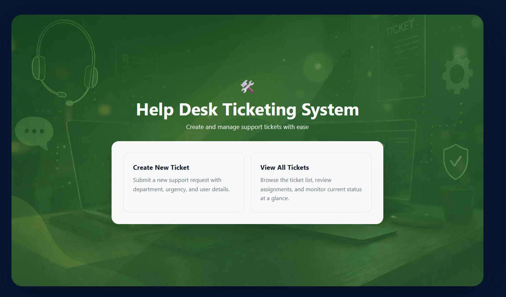
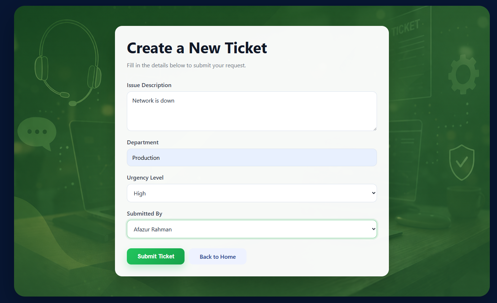
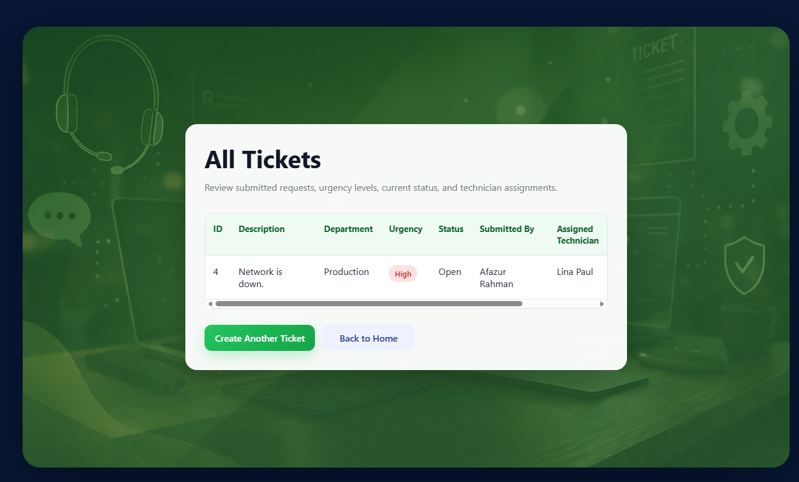

# helpdesk-ticket-system-showcase

📌 HelpDesk Ticket Management System (Showcase)
🚀 Overview

This project demonstrates a HelpDesk Ticket Management System built using modern backend and database technologies. It simulates how organizations manage support requests, assign technicians, and track workload efficiently.

⚠️ This repository is a project showcase only.
Source code is kept private.

🧠 Key Features
Create and manage support tickets
Automatic technician assignment based on workload
Track technician performance
Store and manage users, technicians, and tickets
Database-driven application using relational design
🏗️ System Architecture
User Browser → Spring Boot Application → PostgreSQL → pgAdmin
🛠️ Technologies Used
Technology	Purpose
Java	Core programming
Spring Boot	Backend framework
Spring Data JPA	ORM & database interaction
PostgreSQL	Relational database
Docker	Containerized environment
pgAdmin	Database UI
Gradle	Build tool
Thymeleaf	Frontend templating
🗄️ Database Design

Tables:

app_user → Users who submit tickets
technician → Support staff
ticket → Support requests

Relationships:

One user → many tickets
One technician → many tickets
Ticket links user & technician
⚙️ How It Works
User submits a ticket
System assigns technician based on workload
Ticket is stored in PostgreSQL
Technician workload updates dynamically
📸 Screenshots

👉 Welcome page

👉 Ticket Creation Page

👉 Ticket List Page

🎯 Learning Outcomes
Built a full-stack backend system
Designed relational database schema
Integrated Spring Boot with PostgreSQL
Used Docker for environment setup
Implemented business logic (auto assignment)
🔐 Note

This repository contains documentation only.
Source code is private but available upon request.

👨‍💻 Author

Afazur Rahman
IT Database Administration Student
Nova Scotia Community College (NSCC)

🔗 LinkedIn: https://www.linkedin.com/in/afazur-rahman/

🌐 Portfolio: https://www.afazur.ca
